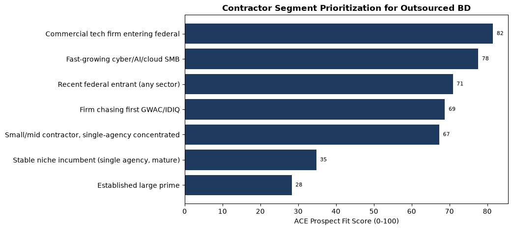

# Outsourced GovCon Business Development — Market Intelligence Report

**Prepared for ACE Business Development**  ·  **Analysis window: FY2015–FY2024**  ·  **Forecast horizon: FY2030**

> Scope note: there is no public dataset that directly measures spending on outsourced GovCon business development. This report triangulates **four independent demand proxies** built from official procurement data, macro data, and search-interest data. All findings are **associational/descriptive**, not causal. Every proxy, assumption, and limitation is documented.

---

## 1. Executive Summary

**The business question:** *Is outsourced GovCon business development a growing market, and where can ACE capitalize?*

**Short answer (evidence-graded):** The *observable conditions that create demand* for outsourced BD — federal technology spending, procurement complexity, contractor entry, and search interest in capture/proposal/BD consulting — are analyzed below over a decade and projected to 2030. The composite **BD Demand Index** summarizes the direction.

- **Highest-priority ACE target segments:** Commercial tech firm entering federal, Fast-growing cyber/AI/cloud SMB, Recent federal entrant (any sector).

- **Caveat:** ~10 annual observations → low statistical power and wide forecast intervals. Treat 2030 figures as scenario ranges, not point predictions.

_[chart 08_bd_demand_index.png pending data run]_

## 2. Research Questions

1. Have the market conditions driving outsourced GovCon BD demand grown over 10 years?
2. Which observable factors co-move with the BD-demand proxies?
3. Which contractor segments are most likely to buy outsourced BD?
4. Is demand likely to keep growing through 2030 (under stated assumptions)?

## 3. Methodology

Descriptive trend analysis (log-linear trends with Newey–West SEs), pooled OLS and two-way fixed-effects panel regressions (agency-year and NAICS-year, SEs clustered by entity), and three forecasting approaches (trend, ARIMA, gradient boosting) validated by expanding-window backtests. Full design in `research_plan.md`.

## 4. Data Sources

USAspending.gov API (primary; obligations, awards, NAICS/PSC, vehicles, recipients), FRED (deflator + macro controls), Census BDS and BLS (sector context), Google Trends (search interest). Detail, endpoints, and limitations in `data_sources.md`.

## 5. Proxy Construction

| Proxy | What it measures | Source | Key weakness |
|---|---|---|---|
| P1 New-entrant | First-time federal recipients/yr | USAspending | First-award ≠ first-attempt |
| P2 Complexity | IDV obligation share, vehicle/order counts | USAspending | Complexity ≠ outsourcing |
| P3 Search | Interest in BD/capture/proposal consulting | Google Trends | Relative, sampled, noisy |
| P4 Tech-entry | Tech obligations × distinct vendors | USAspending | Taxonomy fuzziness |
| **Composite BD Demand Index** | z-scored equal-weight of P1–P4 | derived | Can mask divergence |

Composite: each proxy is z-scored, averaged (equal weights by default), and re-expressed as an index (base FY2015 = 100; +1 sd ≈ +25 points). Components are always shown alongside the composite so divergence is visible.

_[chart 07_proxies.png pending data run]_

## 6. Trend Analysis

**Compound annual growth rates (FY2015→FY2024):**

_[pending data run — generated once the acquisition pipeline runs against live APIs]_

**Trend significance (log-linear, HAC SEs):**

_[pending data run — generated once the acquisition pipeline runs against live APIs]_

_[chart 01_federal_contracting.png pending data run]_

_[chart 02_tech_contracting.png pending data run]_

_[chart 05_complexity.png pending data run]_

_[chart 04_new_entrants.png pending data run]_

_[chart 06_search_interest.png pending data run]_

## 7. Econometric Results

**Pooled OLS — DV: BD Demand Index (standardized betas, HC3 SEs). Associational only:**

_[pending data run — generated once the acquisition pipeline runs against live APIs]_

Panel fixed-effects results (agency-year, NAICS-year; entity+time FE, clustered SEs) are in `outputs/tables/panel_fe_agency.txt` and `panel_fe_naics.txt`. These absorb time-invariant entity differences and common shocks but **do not identify causal effects** — there is no exogenous variation or instrument. Read coefficients as conditional associations on a proxy outcome.

## 8. Forecast Through 2030

**Scenario assumptions:**

_[pending data run — generated once the acquisition pipeline runs against live APIs]_

**Backtest accuracy (expanding window, last 3 FY):**

_[pending data run — generated once the acquisition pipeline runs against live APIs]_

**Forecast table (selected):**

_[pending data run — generated once the acquisition pipeline runs against live APIs]_

_[chart fan_BD_Demand_Index.png pending data run]_

_[chart fan_real_tech_obligations.png pending data run]_

## 9. Contractor Segmentation & ACE Prospect Fit Score

The **ACE Prospect Fit Score** (0–100) ranks segments by likely need for outsourced BD. It is a transparent additive heuristic — **not** a validated predictive model (no ground-truth purchase label exists). Formula and weights: see `src/07_segmentation.py`.

| segment                                          |   ace_prospect_fit_score |   score_equal_weights |   market_growth |   small_mid_size |   new_entrant |   agency_concentration |   tech_category |   vehicle_complexity |   competitive_intensity |   weak_internal_bd |
|:-------------------------------------------------|-------------------------:|----------------------:|----------------:|-----------------:|--------------:|-----------------------:|----------------:|---------------------:|------------------------:|-------------------:|
| Commercial tech firm entering federal            |                     81.5 |                  80   |             0.9 |              0.6 |           1   |                    0.7 |             1   |                  0.5 |                     0.7 |                1   |
| Fast-growing cyber/AI/cloud SMB                  |                     77.6 |                  76.2 |             1   |              0.8 |           0.6 |                    0.6 |             1   |                  0.6 |                     0.8 |                0.7 |
| Recent federal entrant (any sector)              |                     70.9 |                  70   |             0.6 |              0.8 |           1   |                    0.8 |             0.5 |                  0.4 |                     0.6 |                0.9 |
| Firm chasing first GWAC/IDIQ                     |                     68.8 |                  70   |             0.7 |              0.7 |           0.6 |                    0.6 |             0.6 |                  1   |                     0.7 |                0.7 |
| Small/mid contractor, single-agency concentrated |                     67.3 |                  67.5 |             0.6 |              0.9 |           0.5 |                    1   |             0.5 |                  0.5 |                     0.6 |                0.8 |
| Stable niche incumbent (single agency, mature)   |                     34.8 |                  35   |             0.3 |              0.5 |           0.1 |                    0.7 |             0.3 |                  0.3 |                     0.3 |                0.3 |
| Established large prime                          |                     28.3 |                  28.7 |             0.4 |              0.1 |           0.1 |                    0.3 |             0.5 |                  0.4 |                     0.4 |                0.1 |

*Figure: Contractor segment prioritization*

## 10. Implications for ACE Business Development

**Where should ACE look for clients?** The highest-scoring segments are: **Commercial tech firm entering federal, Fast-growing cyber/AI/cloud SMB, Recent federal entrant (any sector)**. These share three traits: recent/imminent federal entry, operation in fast-growing technology markets, and a high likelihood of lacking a mature internal BD/capture function.

- **Most attractive segments:** commercial tech firms crossing into federal; fast-growing cyber/AI/cloud SMBs; recent entrants concentrated in a single agency who need to diversify.
- **Agencies / tech markets driving demand:** the technology-heavy buying centers and the NAICS/PSC tech categories with the fastest real-obligation and vendor-count growth (see Section 6 tables) are where outsourced-BD need concentrates.
- **Positioning:** lead with *capture + proposal + federal market-entry as a managed service* for firms with strong technical product but weak federal sales infrastructure. Emphasize vehicle strategy (GWAC/IDIQ/BPA access) where complexity is rising.
- **Internal data ACE should collect** to upgrade this model: win/loss by pursuit, client size and federal tenure at engagement start, agency-concentration of clients, services purchased, and outcomes. That converts this heuristic into a *trainable* propensity model.

## 11. Limitations

- **No direct dependent variable** — outsourced-BD spend is unobservable; all results concern proxies.
- **Associational, not causal** — no identification strategy.
- **Small N (~10 annual points)** — low power, wide intervals, ML overfitting risk.
- **Obligations ≠ outlays ≠ vendor revenue**; fiscal vs calendar alignment handled but imperfect.
- **Recipient dedup / top-N sampling** make entrant and concentration figures approximate.
- **Google Trends** is relative and noisy.
- **Segmentation score is judgment-encoded**, not validated. Full list in `research_plan.md` §9 and `quality_control.md`.

## 12. Recommended Next Steps

1. Acquire a true contractor-history extract (bulk USAspending) for exact first-award entrant detection and population-level concentration.
2. Add a compliant job-postings feed (e.g., licensed Lightcast) for a labor-demand proxy.
3. Collect ACE's internal win/loss + client-profile data to train and validate a real propensity model against the Prospect Fit heuristic.
4. Refresh quarterly; widen to sub-award and B&P signals if obtainable.

---
*Generated by `src/08_generate_report.py`. Reproduce with the pipeline in `README.md`. All figures regenerate from `data/processed/`.*
